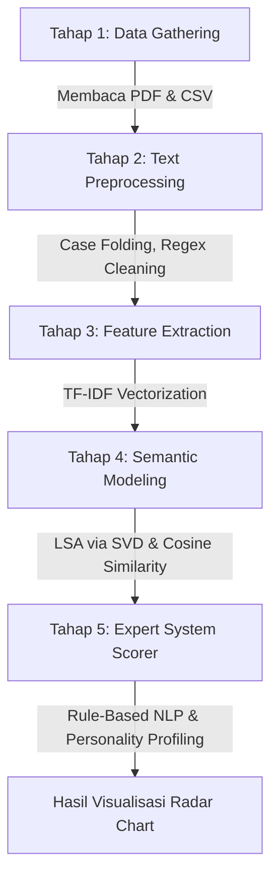

# 📄 CV-Match AI — Sistem Analisis & Pencocokan Karir Berbasis NLP

CV-Match AI adalah aplikasi web cerdas berbasis Python dan Natural Language Processing (NLP) yang dirancang untuk menganalisis dokumen CV (PDF) pengguna secara otomatis dan mencocokkannya dengan berbagai peran pekerjaan industri secara semantik.

Aplikasi ini dikembangkan untuk mata kuliah **Perancangan Aplikasi Sains Data**, Fakultas Informatika, Telkom University.

---

## 🔬 Alur Proses & Pipeline Sains Data (5 Tahapan)

Aplikasi ini menggunakan pipeline pemrosesan teks tingkat lanjut untuk menganalisis dan menilai kecocokan CV Anda:



1. **[TAHAP 1] Data Gathering (Pengumpulan Data)**: Membaca teks secara dinamis dari dokumen CV berformat PDF menggunakan library `PyPDF2` dan memuat dataset karir pekerjaan industri dari file `job_roles_dataset.csv`.
2. **[TAHAP 2] Text Preprocessing (Pembersihan Teks)**: Mengubah seluruh teks menjadi huruf kecil (*case folding*), menghapus karakter non-alphanumeric (simbol khusus) dengan *regular expressions* (Regex), serta membersihkan spasi berlebih untuk menjamin konsistensi data.
3. **[TAHAP 3] Feature Extraction (Ekstraksi Fitur)**: Mengubah korpus kata menjadi matriks bobot numerik menggunakan metode **TF-IDF (Term Frequency-Inverse Document Frequency)** dengan rentang *n-gram* (1, 2) untuk menangkap frasa penting.
4. **[TAHAP 4] Semantic Modeling (Pemodelan Semantik)**: Mengompresi dimensi matriks kata menggunakan **LSA (Latent Semantic Analysis)** dengan metode **SVD (Singular Value Decomposition)** untuk menangkap hubungan sinonim kata kunci. Tingkat kecocokan dihitung secara matematis menggunakan **Cosine Similarity**.
5. **[TAHAP 5] Expert System (Sistem Pakar)**: Menggunakan pendekatan *Rule-Based NLP* untuk menghitung skor kelayakan CV berdasarkan kehadiran kata kerja aktif (*Action Verbs*) dan metrik pencapaian (angka/%), serta melakukan *profiling* Soft Skills menggunakan pendekatan *Lexicon Text-Mining*.

---

## 📂 Struktur Proyek

```
shopee_web/
├── app.py                  ← Server utama Flask (Routing web)
├── cv_engine.py            ← Engine inti pemrosesan NLP & Sains Data
├── generate_jobs.py        ← Skrip pembuat dataset pekerjaan industri
├── job_roles_dataset.csv   ← Dataset utama (73 Peran Pekerjaan + Deskripsi + Skills)
├── requirements.txt        ← Daftar dependensi pustaka Python
├── Dockerfile              ← Konfigurasi containerisasi Docker
├── railway.toml            ← Konfigurasi deployment Cloud Railway
├── templates/
│   ├── base.html           ← Layout dasar aplikasi (Navbar, Footer, CSS tema)
│   ├── home.html           ← Halaman beranda + Drag & Drop PDF + Penjelasan Pipeline
│   └── hasil.html          ← Halaman hasil analisis (Laporan Pipeline, Radar Charts, Profiling)
└── uploads/                ← Folder penyimpanan sementara file CV PDF
```

---

## 📊 Dataset Karir Industri (73 Peran Aktif)
Dataset dalam `job_roles_dataset.csv` diperbanyak secara masif hingga mencakup **73 peran pekerjaan** dalam berbagai bidang spesifik seperti:
- **Data & AI**: Data Scientist, Data Engineer, Machine Learning Engineer, Deep Learning Engineer, NLP Engineer, Computer Vision Engineer, Prompt Engineer.
- **Software Engineering**: Frontend, Backend, Fullstack Developer, Android & iOS Developer, Flutter Developer, QA Automation, Game Developer, Blockchain Developer.
- **Infrastructure & Security**: DevOps Engineer, SRE, Cloud Architect, Database Administrator, Systems Engineer, Cyber Security, Penetration Tester, Network Engineer.
- **Product & Design**: UI/UX Designer, UX Researcher, Product Designer, Product Manager, Scrum Master, Product Owner.
- **Business & Operations**: Business Analyst, ERP Specialist, Supply Chain Analyst, Operations Manager, Sales Executive, Key Account Manager, HR Manager.
- **Creative & Others**: Video Editor, 3D Artist, Animator, Mechanical, Electrical, & Civil Engineer.

---

## ⚡ Cara Menjalankan Aplikasi Secara Lokal

### 1. Install Dependensi Pustaka
Pastikan Anda sudah menginstal pustaka sains data dan library pembaca PDF yang diperlukan:
```bash
pip install -r requirements.txt
```
*Atau instal secara manual:*
```bash
pip install flask pandas numpy scikit-learn PyPDF2
```

### 2. Regenerasi Dataset (Opsional)
Untuk memperbarui file dataset CSV dengan 73 peran pekerjaan terbaru:
```bash
python generate_jobs.py
```

### 3. Jalankan Server Flask
Mulai server web lokal Anda dengan menjalankan perintah berikut:
```bash
python app.py
```

### 4. Buka di Browser Anda
Akses aplikasi melalui peramban web di:
```
http://localhost:5000
```

---

## 🎨 Tampilan Fitur Utama Aplikasi

- **Drag & Drop PDF Uploader**: Unggah file CV Anda secara intuitif langsung di halaman beranda.
- **Interactive Data Pipeline Accordion**: Laporan visual step-by-step tentang apa yang dikerjakan AI terhadap teks CV Anda pada halaman hasil analisis.
- **CV Quality Scorer & Advice**: Penilaian kualitas CV berbasis data metrik kuantitatif dan rekomendasi saran perbaikan.
- **Soft Skill Profiling**: Mendeteksi tingkat Kepemimpinan, Kerja Sama, Komunikasi, Adaptasi, dan Pemecahan Masalah Anda secara objektif.
- **Top 5 Role Semantic Match**: Menampilkan 5 pekerjaan paling cocok beserta visualisasi grafis **Radar Chart (Chart.js)** untuk pemetaan gap keterampilan (*skill gaps*).
